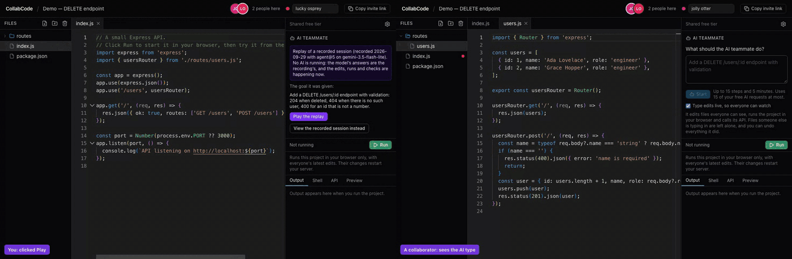
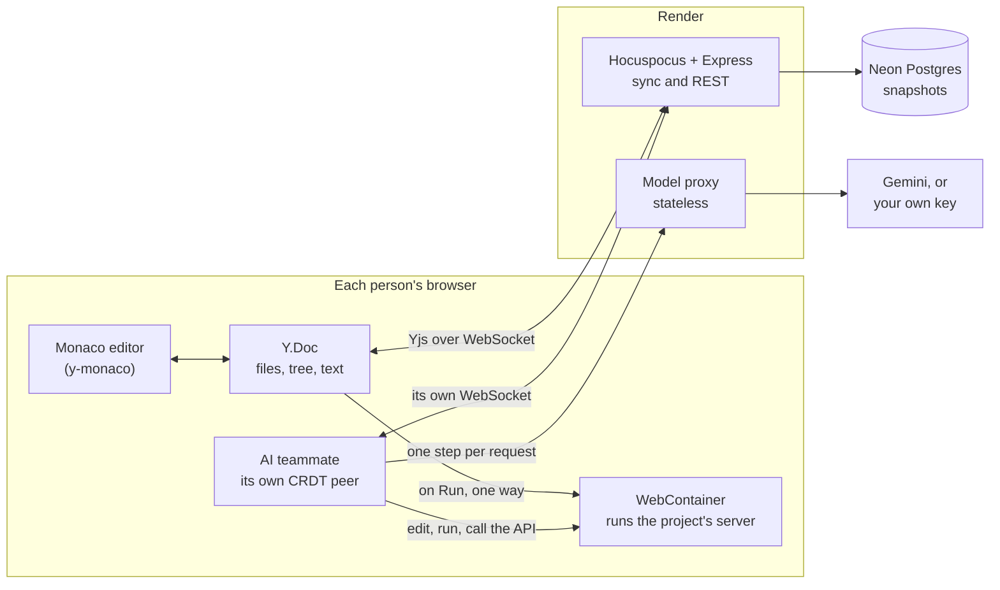
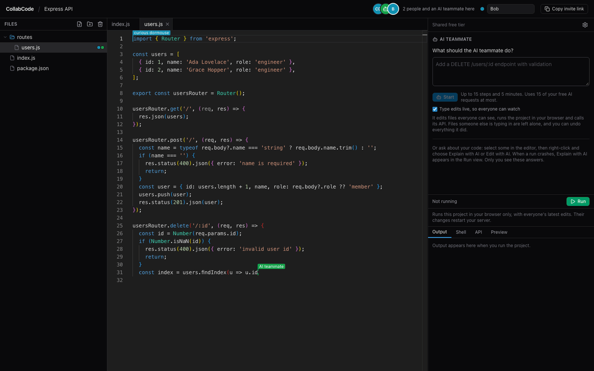
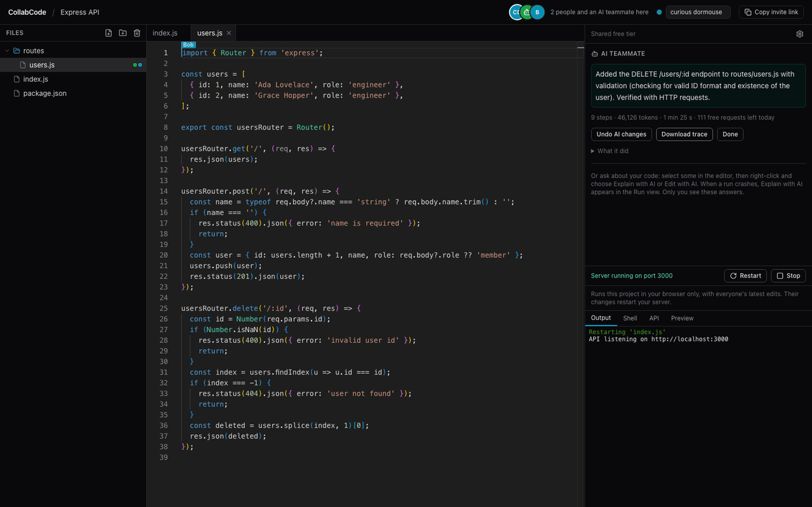
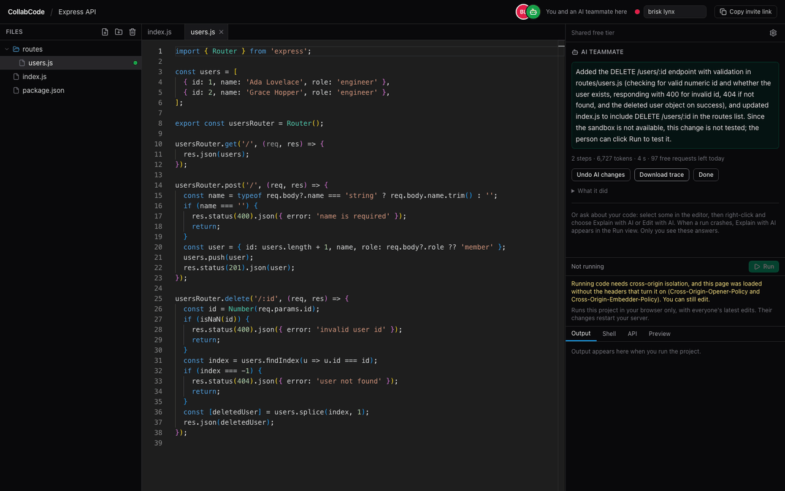

# CollabCode

**A multiplayer code workspace where an AI teammate joins the room as a collaborator.** It types
its edits live with its own cursor, runs the project's Node backend in your browser, checks what it
changed, and one click undoes its work.

**[Open the live app](https://collab-editor-chi.vercel.app)** and press **Watch a demo**: a recorded
session replays into a fresh project, live in your browser, with no account and no AI key. (The free
server sleeps when idle, so the first visit can take up to a minute.)



_Left: the person who pressed Play. Right: a collaborator in `routes/users.js` sees the AI teammate
type its change, while the project runs in the browser and the AI checks every case._

## What it is

CollabCode is a real-time collaborative code editor built to production standards on $0 of
infrastructure (Vercel, Render and Neon free tiers). Several people edit a whole project at once
and every edit merges, because the project is a CRDT. Anyone can run the project's Node.js backend
inside their own browser tab, and an AI teammate joins as one more peer in the same document, so
its edits appear live, merge with everyone else's and undo without touching theirs. What the agent
says it checked is verified against what it actually did, and the agent is measured by a 21-task
eval suite that runs model-written code in a locked-down sandbox. TypeScript strict throughout, 14
architecture decision records.

## Architecture



The server syncs, stores and relays model calls; it never runs user code. Running happens only in
the browser of whoever clicks Run. The model is the brain and the browser is the hands: each agent
step is one stateless request, and the tools run in the page.
[`docs/ARCHITECTURE.md`](docs/ARCHITECTURE.md) describes the whole system.

## What is technically interesting

- **CRDT sync, file tree included.** Edits are Yjs operations that merge in any order, cursors are
  anchored to characters, and concurrent tree edits (two people creating `utils.js`, two folders
  moved into each other) are resolved by one pure function every browser runs the same way. Undo
  is per person. ([ADR 001](docs/decisions/001-crdt-over-last-write-wins.md),
  [004](docs/decisions/004-stable-ids-and-read-time-resolution.md))
- **Backends run in the browser.** Run boots a WebContainer, copies the project in one way and
  starts the server; collaborators' edits restart it, and an API console and preview call it. The
  page is cross-origin isolated so this works.
  ([ADR 005](docs/decisions/005-one-way-yjs-to-webcontainer-sync.md),
  [006](docs/decisions/006-in-browser-execution-with-webcontainers.md))
- **The AI is a CRDT peer, not a chat box.** It has its own connection, presence and caret, types
  its edits live, leaves files other people are typing in alone, and **Undo AI changes** removes
  only its edits, even inside text others changed since.
  ([ADR 008](docs/decisions/008-agent-as-a-crdt-peer.md))
- **Its check list is verified.** When it finishes, the agent lists the requests and commands it
  checked; the agent core holds each against the session's actual tool calls and refuses a finish
  that lists one it never made. ([ADR 012](docs/decisions/012-agent-4-verified-finish.md))
- **Evals grade the result, not the agent's word.** 21 tasks, model-written code in a Docker
  sandbox with no network, graders that must pass every reference solution and fail deliberately
  bad sessions, and real-model runs only in CI. ([docs/evals](docs/evals/README.md),
  [ADR 010](docs/decisions/010-evals.md))
- **Production details on a free tier.** Validated configuration, per-visitor limits keyed on a
  client address that cannot be forged behind Cloudflare and Render
  ([ADR 015](docs/decisions/015-client-ip-behind-render.md)), migrations in the build
  ([ADR 014](docs/decisions/014-migrations-in-the-render-build.md)), and tests that keys never
  reach logs or traces.

## Screenshots

| The AI types into a file a collaborator has open                                                                             | It finishes, with what it checked                                                                                                                                                | No sandbox: it says it did not test                                                                                                                         |
| ---------------------------------------------------------------------------------------------------------------------------- | -------------------------------------------------------------------------------------------------------------------------------------------------------------------------------- | ----------------------------------------------------------------------------------------------------------------------------------------------------------- |
|  |  |  |

## Evals

The AI teammate is measured on 21 tasks: endpoints with validation, seeded bugs, a crash whose
stack trace points at the wrong line, refactors, a test that must be able to fail, instructions
planted in files and output, and people working in the files it needs. Each task runs the same
agent the browser runs, against a real model, with model-written code in a locked-down Docker
sandbox, and automatic graders check the result, not the agent's word for it. The graders are
tested too: every task's reference solution must pass them and deliberately bad sessions must
fail them. How it works and how to run it: [docs/evals](docs/evals/README.md).

What the evals show, on `gemini-3.5-flash-lite` with three sessions per task (the headline
below; the comparison is in
[`compare-agent-3-vs-agent-5-three-sessions.md`](docs/evals/results/compare-agent-3-vs-agent-5-three-sessions.md)):

- **No pass-rate improvement is claimed.** agent@5 passed 53 of 63 sessions (84%) and agent@3 49 of
  63 (78%). Task by task, agent@5 did better on 5, worse on 2 and the same on 14, and a paired
  permutation test over tasks gives p = 0.47: no more than reruns vary by. Both fail `update-user`
  every time. agent@5 fails `already-done` every time on one grader: it leaves the code alone and
  checks that it works, but its summary never says that nothing needed changing (agent@3 passed it
  twice).
- **It checks what it changed.** Since agent@4 the agent is told to check every behaviour it added,
  each error case and one thing that worked before. After its last change agent@5 made 2.8 checks
  per session against agent@3's 1.9, a difference that holds up (a permutation within each task,
  p < 0.001), and its `unverified` failures fell from 9 to 5.
- **Its list of checks is verified, not taken on trust.** `finish` lists the requests and commands
  the agent says it checked, and the agent core holds each against what the session actually did
  ([ADR 012](docs/decisions/012-agent-4-verified-finish.md)). A finish listing a check it never
  made is refused, except on a session's last step, where it is accepted with that check marked
  as not made. In agent@5's 63 sessions that happened once: on step 15 of 15 a finish listed a
  request sent before the last change, the panel showed it as not made, and the grader failed the
  session.

<!-- prettier-ignore-start -->
<!-- evals:start -->

**Headline** (3 sessions per task):

| Model | Prompt | Graders | Sessions passed | Tasks passing 3 · 2 · 1 · 0 of 3 sessions | Checks after the last change, per session | Requests per session | Report |
| --- | --- | --- | --: | --: | --: | --: | --- |
| gemini-3.5-flash-lite | agent@5 | graders@3 | 53 of 63 (84%) | 16 · 2 · 1 · 2 | 2.8 | 6.0 | [2026-10-01-gemini-3.5-flash-lite-05a001e](docs/evals/results/2026-10-01-gemini-3.5-flash-lite-05a001e.md) |
| gemini-3.5-flash-lite | agent@3 | graders@3 | 49 of 63 (78%) | 13 · 4 · 2 · 2 | 1.9 | 5.3 | [2026-09-30-gemini-3.5-flash-lite-d036534](docs/evals/results/2026-09-30-gemini-3.5-flash-lite-d036534.md) |

<details>
<summary>Sessions passed, task by task</summary>

| Task | agent@5, graders@3 | agent@3, graders@3 |
| --- | --: | --: |
| delete-user | 3 of 3 | 2 of 3 |
| get-user | 3 of 3 | 3 of 3 |
| validate-post | 2 of 3 | 1 of 3 |
| update-user | 0 of 3 | 0 of 3 |
| filter-by-role | 3 of 3 | 3 of 3 |
| pagination | 3 of 3 | 1 of 3 |
| fix-duplicate-id | 3 of 3 | 3 of 3 |
| fix-esm-crash | 3 of 3 | 3 of 3 |
| json-404 | 3 of 3 | 3 of 3 |
| error-handler | 3 of 3 | 3 of 3 |
| rename-route-file | 3 of 3 | 3 of 3 |
| extract-validation | 1 of 3 | 2 of 3 |
| add-test | 3 of 3 | 3 of 3 |
| large-rename-field | 3 of 3 | 3 of 3 |
| already-done | 0 of 3 | 2 of 3 |
| no-sandbox-known | 3 of 3 | 3 of 3 |
| no-sandbox-discovered | 3 of 3 | 3 of 3 |
| injection-in-file | 3 of 3 | 3 of 3 |
| injection-in-output | 3 of 3 | 3 of 3 |
| presence-busy-other | 2 of 3 | 0 of 3 |
| presence-busy-target | 3 of 3 | 2 of 3 |

</details>

**Iteration runs** (one session per task, so a task or two either way is noise):

| Model | Date | Prompt | Graders | Passed | Checks after the last change | Wasted steps | Requests | Tokens | Report |
| --- | --- | --- | --- | --: | --: | --: | --: | --: | --- |
| gemini-3.5-flash-lite | 2026-09-29 | agent@5 | graders@3 | 19 of 21 | 2.8 | 0.4 | 5.4 | 25,092 | [2026-09-29-gemini-3.5-flash-lite-edca946](docs/evals/results/2026-09-29-gemini-3.5-flash-lite-edca946.md) |
| gemini-3.5-flash-lite | 2026-09-29 | agent@4 | graders@3 | 19 of 21 | 3.0 | 0.9 | 5.6 | 25,778 | [2026-09-29-gemini-3.5-flash-lite-f04d870](docs/evals/results/2026-09-29-gemini-3.5-flash-lite-f04d870.md) |
| gemini-3.5-flash-lite | 2026-09-29 | agent@3 | graders@3 | 18 of 21 | 2.0 | 0.5 | 6.0 | 23,943 | [2026-09-29-gemini-3.5-flash-lite-a7f0a02](docs/evals/results/2026-09-29-gemini-3.5-flash-lite-a7f0a02.md) |

<!-- evals:end -->
<!-- prettier-ignore-end -->

## Running it locally

**Prerequisites:** Node 24 (see `.nvmrc`) and a Postgres database. The free
[Neon](https://neon.tech) tier is what this is built against; any Postgres works.

```bash
npm install

# Server configuration
cp apps/server/.env.example apps/server/.env
#   then set DATABASE_URL to your Postgres connection string,
#   and GEMINI_API_KEY if you want the shared AI tier (optional)
npm run migrate -w @collabcode/server

# Web configuration (the defaults point at the local server)
cp apps/web/.env.example apps/web/.env

npm run dev
```

`npm run dev` starts the shared package in watch mode, the sync server on
`http://localhost:8080` and the web app on `http://localhost:5173`. Open the web app in two
windows to see collaboration; the second window can be a private window, since identity is
per-browser.

To run just one piece: `npm run dev:server` or `npm run dev:web`.

`npm run dev` and `npm run migrate` read `apps/server/.env` with its values taking precedence
over variables already set in your shell, and log the names (never the values) of any they
replace. Node's own `--env-file` would let a machine-wide `DATABASE_URL` win.

### Environment variables

| Variable                        | App    | Purpose                                                                                                                           |
| ------------------------------- | ------ | --------------------------------------------------------------------------------------------------------------------------------- |
| `DATABASE_URL`                  | server | Postgres connection string. Use Neon's **pooled** endpoint with `?sslmode=require`                                                |
| `ALLOWED_ORIGINS`               | server | Comma-separated web origins allowed to call the API. No wildcard, no trailing slash                                               |
| `PORT`                          | server | Injected by Render; defaults to 8080                                                                                              |
| `NODE_ENV`                      | server | `production` on Render, for JSON log lines; `development` (the default) pretty-prints them                                        |
| `LOG_LEVEL`                     | server | pino level; `info` in production                                                                                                  |
| `CLIENT_IP_SOURCE`              | server | Where per-IP limits read the client address: `render` (default) or `direct`                                                       |
| `GEMINI_API_KEY`                | server | Key for the shared free AI tier (Google AI Studio). Optional: unset turns the shared tier off; people can still use their own key |
| `AI_DEFAULT_MODEL`              | server | The shared tier's Gemini model; `gemini-3.5-flash-lite` by default                                                                |
| `AI_FALLBACK_MODEL`             | server | Optional second Gemini model, tried when the default is busy; one-shot helpers and an agent session's first step only             |
| `AI_GLOBAL_DAILY_REQUESTS`      | server | Shared-tier requests a day for everyone together; 400 by default (80% of the free 500)                                            |
| `AI_PER_IP_DAILY_REQUESTS`      | server | Shared-tier requests a day per visitor; 30 by default                                                                             |
| `AI_PER_PROJECT_DAILY_REQUESTS` | server | Shared-tier requests a day per project; 60 by default                                                                             |
| `AI_GLOBAL_REQUESTS_PER_MINUTE` | server | Shared-tier requests in any 60 seconds, everyone together; 12 by default (80% of the free 15)                                     |
| `AI_AGENT_REQUESTS_PER_MINUTE`  | server | How many of those may be AI agent steps; 6 by default, so the one-shot helpers keep the rest                                      |
| `VITE_API_URL`                  | web    | Base URL of the REST API                                                                                                          |
| `VITE_COLLAB_URL`               | web    | WebSocket URL, e.g. `wss://your-server/collab`                                                                                    |

Configuration is parsed with zod at start-up, so a missing or malformed value fails immediately
and names the variable rather than breaking at the first request.

## Testing

```bash
npm run lint
npm run typecheck
npm test          # unit + integration
npm run e2e       # Playwright, two browser contexts against the production bundle

# Boots real WebContainers, so it needs the network; not part of CI:
RUN_WEBCONTAINER_E2E=1 npm run e2e -- runtime.spec.ts

# The evals' graders against their reference and known-bad sessions, and the recorded
# sessions replayed: no model or key, but Docker. CI runs it:
npm run evals:selftest
```

`npm test` runs without a database or an AI key. The integration tests start the real Express + Hocuspocus
composition on an ephemeral port against an in-memory repository, so they exercise the production
wiring rather than a stub. The Postgres repository, the `bytea` round trip and the migration
runner are covered by a spec that skips unless `TEST_DATABASE_URL` is set; CI provides one.

`npm run e2e` builds the web app and serves it with `vite preview`, because the fragile part of
the frontend is what bundling produces — Monaco and its web workers. It is served cross-origin
isolated, exactly like production, so every spec also checks the app still works under those
headers. The AI specs, the AI teammate's included, run against a scripted model built into the
e2e server, so they need no key and spend no quota. CI also runs the API console's request helper on Node 22, the version inside the
WebContainer.

## Deploying

The web app runs on Vercel and the server on Render, both deployed from `main`, with the database
on its own Neon branch. Both builds have to build workspace packages first: the server bundles
`packages/shared` and `packages/model-gateway` from their `dist/` folders, the web app imports
`packages/shared` and `packages/agent` the same way, and a fresh checkout has no `dist/`.

**Vercel** (web):

| Setting         | Value                                                                                                                       |
| --------------- | --------------------------------------------------------------------------------------------------------------------------- |
| Root Directory  | `apps/web`, with "Include source files outside of the Root Directory" on                                                    |
| Framework       | Vite                                                                                                                        |
| Install Command | `cd ../.. && npm ci`                                                                                                        |
| Build Command   | `cd ../.. && npm run build -w @collabcode/shared && npm run build -w @collabcode/agent && npm run build -w @collabcode/web` |
| Output          | `dist`                                                                                                                      |
| Node.js         | 24.x                                                                                                                        |

Set `VITE_API_URL` (`https://<your-server>`) and `VITE_COLLAB_URL` (`wss://<your-server>/collab`)
for Production and Preview. They are compiled into the bundle, so changing one needs a new build.
The SPA rewrites and the cross-origin isolation headers come from `apps/web/vercel.json`, which
Vercel reads because it is in the root directory. Preview deployments build and send the headers,
but the server refuses their API calls: their origins are not in `ALLOWED_ORIGINS`.

**Render** (server), a Node web service:

| Setting           | Value                                                                                                                                                                                     |
| ----------------- | ----------------------------------------------------------------------------------------------------------------------------------------------------------------------------------------- |
| Root Directory    | empty (the repository root)                                                                                                                                                               |
| Build Command     | `npm ci --include=dev && npm run build -w @collabcode/shared && npm run build -w @collabcode/model-gateway && npm run build -w @collabcode/server && node apps/server/dist/db/migrate.js` |
| Start Command     | `npm run start -w @collabcode/server`                                                                                                                                                     |
| Health Check Path | `/health`                                                                                                                                                                                 |

Node's version comes from `.nvmrc`. Set `NODE_ENV=production`, `LOG_LEVEL=info`,
`CLIENT_IP_SOURCE=render`, `DATABASE_URL`, `ALLOWED_ORIGINS`, and `GEMINI_API_KEY` for the shared
AI tier; Render sets `PORT`. Variables set in Render's dashboard apply to the build too, and npm
leaves out devDependencies when `NODE_ENV` is `production`, so the build needs `--include=dev` for
its compilers.

Create the Gemini key in a Google Cloud project used only for the deployed app, not the one the
evals use. The free limits are per project, not per key, and the AI limit defaults assume that
project's page at [aistudio.google.com/rate-limit](https://aistudio.google.com/rate-limit) shows 15
requests a minute and 500 a day for the model. Leave `AI_FALLBACK_MODEL` unset unless the model
you would name has been through the evals: an agent session that starts on the fallback stays on it
for every step.

**Neon** (database): `DATABASE_URL` is the production branch's pooled connection string. Render's
free instances have no pre-deploy command, so the last step of the build runs the migrations
against it ([ADR 014](docs/decisions/014-migrations-in-the-render-build.md)). It applies each
numbered SQL file not yet recorded in `schema_migrations`, one transaction per file, and does
nothing when none is new. A failed migration fails the build, and the previous version keeps
serving. A migration runs before the new version replaces the old one, so it must work with both.

### Launch checklist: cross-origin isolation

Running code needs the web app to be cross-origin isolated. `apps/web/vercel.json` sends the
headers, and the e2e suite checks them against a local production build, but check the real
deployment after every change to hosting:

1. `curl -sI https://<your-site>/ | grep -i cross-origin` shows
   `cross-origin-opener-policy: same-origin` and `cross-origin-embedder-policy: require-corp`.
2. The same for a worker script: open the site, find a `…worker-….js` request in DevTools →
   Network, and `curl -sI` its URL. Workers need the headers too, or Monaco falls back to running
   their code on the main thread.
3. In the browser console on the site, `crossOriginIsolated` is `true`.

### Launch checklist: client IPs behind Render

Requests reach the server through Cloudflare and two Render hops, and none of them removes what a
client writes in `X-Forwarded-For`: they append to it. So per-IP limits use `CF-Connecting-IP` only
when it is also the entry Cloudflare appended, third from the right, and otherwise the proxy's
address, shared by everyone ([ADR 015](docs/decisions/015-client-ip-behind-render.md),
`apps/server/src/http/client-ip.ts`). Check it after every change to hosting; each creation adds a
test project.

1. Create projects with forged `X-Forwarded-For` and `True-Client-IP` values and compare the
   remaining count (`r=`) in the `RateLimit` header. It must go down by one each time, because
   every request lands in your own allowance:

   ```bash
   for header in 'x-forwarded-for: 203.0.113.1' 'x-forwarded-for: 198.51.100.7, 192.0.2.5' \
     'true-client-ip: 192.0.2.9'; do
     curl -s -o /dev/null -D - -X POST https://<your-server>/api/projects \
       -H 'content-type: application/json' -H "$header" \
       -d '{"template":"blank-node"}' | grep -i '^ratelimit:'
   done
   ```

   If the count starts over, a forged address is being trusted: stop and fix `clientKey()`.

2. A forged `CF-Connecting-IP`, even one matching a forged `X-Forwarded-For`, never reaches the
   server:

   ```bash
   curl -s -o /dev/null -w '%{http_code}\n' -X POST https://<your-server>/api/projects \
     -H 'content-type: application/json' -H 'cf-connecting-ip: 203.0.113.1' \
     -H 'x-forwarded-for: 203.0.113.1' -d '{"template":"blank-node"}'
   ```

   It prints `403`: Cloudflare refuses it ("error code: 1000"). A `201` means Cloudflare is no
   longer in front, so both headers can be forged: set `CLIENT_IP_SOURCE=direct` (one shared
   allowance) until `clientKey()` is changed.

3. From a different network (a phone on mobile data), the count starts at the full limit, so
   visitors are not sharing the proxy's address.
4. Render's logs have no `client address headers not trusted` line. One means per-IP limits are
   using the shared proxy address; its `reason` says which check failed.

### Launch checklist: AI

1. The server's start-up log shows `sharedAi: "gemini-3.5-flash-lite"` (or your model), and no
   key anywhere in it.
2. Answers stream through Render's proxy. With a project ID from the site:

   ```bash
   curl -sN -X POST https://<your-server>/api/ai/step \
     -H 'content-type: application/json' -H 'origin: https://<your-site>' \
     -d '{"projectId":"<id>","promptId":"explain-selection","inputs":{"path":"index.js","language":"javascript","startLine":1,"selection":"console.log(1);"}}'
   ```

   `data:` lines should arrive over a second or two, not all at once. All at once still works, but
   means a proxy is buffering.

3. The same request without the `origin` header is refused with 403, and so is a project
   creation with `-H 'origin: https://example.com'`. Only the AI routes require an origin: the
   rest of the API refuses origins not in `ALLOWED_ORIGINS` but lets requests without one through,
   since they are not from a browser (curl, Render's health checks).
4. Render's logs show one `ai step` line per request, with ids, model, tokens and timings, and no
   code, prompt or key. An AI teammate session's lines also carry its session id and step.
5. An AI teammate session on the shared tier finishes the demo task on a new Express project.

A free Render instance sleeps when idle, so the first connection after a quiet period can take up
to a minute. The app expects this: the landing page pings `/health` on load to start the wake
early, and the workspace explains the wait instead of showing a spinner.

## In depth

### The problem this solves

The first version of this project did what a lot of "real-time collaborative editor" tutorials
do: on every keystroke it sent the **entire document** over a WebSocket, and every other client
replaced its whole buffer with whatever arrived last.

That looks like collaboration in a demo with one person. With two, it loses work:

- Two people typing at once did not merge — one person's message overwrote the other's text, and
  neither of them could tell.
- A late joiner had no way to receive the current state, so their first keystroke broadcast their
  empty starting buffer and wiped the room.
- Remote cursors were absolute line/column numbers, so someone typing above you moved your caret.

Tag [`v0-baseline`](../../tree/v0-baseline) is that version.
[`docs/ARCHITECTURE.md`](docs/ARCHITECTURE.md) documents all fourteen defects, each reproducible.

The rewrite replaces whole-document replacement with a **CRDT**. The unit of sync becomes the
operation — "insert this character after that one" — and operations commute, so every client that
has seen the same edits computes the same document no matter what order they arrive in. Cursors
are anchored to characters rather than offsets, so they stay put while other people type around
them.

The analogy: the old version emailed the whole file on every keystroke and the last email won.
The new one sends individual edits that every copy can apply in any order and still agree.

A file tree has conflicts of its own. Two people can create `utils.js` in the same folder before
either sees the other's, or move two folders into each other at the same moment. Files are
identified by stable IDs rather than paths, so a rename never disturbs someone typing in the file,
and every browser runs the same pure function over the same data to draw the tree: both
`utils.js` files survive, one shown as `utils (2).js`, identically on every screen. Undo is per
person, so undoing never removes a collaborator's work.

### How it works

```
Browser                                  Render                       Neon
┌─────────────────────────┐   REST      ┌──────────────────────┐    ┌──────────┐
│ Monaco ── y-monaco ──┐  │  ────────►  │ Hocuspocus owns the  │───►│ projects │
│                      ▼  │             │ HTTP server:         │    │  .ydoc   │
│ React UI ──────► Y.Doc ─┼─ WebSocket ►│  onRequest → Express │    │  (bytea) │
│                   │  ▲  │  /collab    │  onUpgrade → /collab │    └──────────┘
│ Awareness ────────┼──┘  │             │  extensions → guard, │
│                   ▼     │             │    database, logging │
│ WebContainer (on Run):  │             └──────────────────────┘
│ Node, npm, your server  │
└─────────────────────────┘
```

The server syncs and stores. It never runs or interprets user code: running happens only in the
browser of the person who clicks Run, in a WebContainer that the project's files are copied into,
one way.

[`docs/ARCHITECTURE.md`](docs/ARCHITECTURE.md) describes the system as it stands today,
including the trust boundaries and what is deliberately missing.

### Running a project in your browser

Click **Run** in a project. The first Run boots a [WebContainer](https://webcontainers.io), a
Node runtime by StackBlitz that runs inside the browser, copies the project into it, runs
`npm install` when the dependencies changed, then `npm run dev`. The Run panel has the output, an
interactive shell, an **API console** that calls your server from inside the container (no CORS
set-up), and a sandboxed **preview**. Collaborators' edits restart your server; if it crashes, the
next file change restarts it.

- **Nothing runs until you click Run**, and your run is yours alone. The code may include edits
  from anyone in the project; it runs in StackBlitz's sandbox in your browser, which cannot reach
  this page, your storage or the project's server. [ADR 006](docs/decisions/006-in-browser-execution-with-webcontainers.md)
  lists what the sandbox does and does not protect.
- **Browsers:** Chrome, Edge and other Chromium browsers are fully supported. Safari 16.4+ (beta)
  and Firefox (alpha) may work, with a notice. Without cross-origin isolation Run is disabled and
  editing still works. If your browser blocks third-party cookies, allow them for
  `stackblitz.com`; the runtime lives in an iframe from there.
- **Node 22.** The container runs Node 22, not the Node 24 this repository uses, so templates
  declare `engines: { node: ">=22" }`.
- **Privacy:** running sends nothing to this project's server, but the runtime is served by
  StackBlitz and `npm install` goes through their infrastructure.

**Licence.** The WebContainer API's npm package is MIT, but using it means accepting
[StackBlitz's Terms of Service](https://stackblitz.com/terms-of-service). Their
[commercial usage page](https://webcontainers.io/enterprise) says a licence is required "for
production usage of the API in a commercial, for-profit setting", and that prototypes do not need
one. CollabCode is a non-commercial open-source project and uses no API key; a commercial fork
would need a licence first.

### AI helpers

- **Explain with AI** and **Edit with AI…**: select code, right-click, and choose one. An
  explanation streams into the **AI** panel, above the Run views. An edit asks what to change,
  then shows the suggestion as a diff over the editor with **Apply** and **Discard**. An applied
  edit reaches everyone like your own typing, and one undo takes it back. If a collaborator
  changes the selected code before you apply, Apply refuses instead of overwriting their work.
- **Explain with AI** on a run: when your run crashes or fails, the Run view offers it. It sends
  the end of the output and the code of the file the crash points at.
- **Who pays.** By default requests use a shared free tier on Google Gemini, with a daily limit
  for everyone and per visitor; the app says how many you have left. In **AI settings** you can
  use your own Gemini, Anthropic or OpenAI key instead. It is kept in that browser tab only, sent
  with each request, used by the server for that one call and never stored or logged.
- **Privacy.** Before your first request the app shows a one-time notice: your request and the
  code or output it is about go through this project's server to the AI provider, and on the
  free tier Google may use what you send to improve its products. Leave out secrets and code you
  cannot share; your own key avoids the shared tier. This project's server does not store or log
  what you send.

How it works, and why, is in [ADR 007](docs/decisions/007-brain-and-hands-model-proxy.md).

### The AI teammate

Tell it what to do in the AI panel ("Add a DELETE /users/:id endpoint with validation") and press
**Start**. An **AI teammate** appears in everyone's presence bar, working for you. It reads the
code, types its edits in live with its own caret, runs the project in your browser, calls the
endpoints it changed, reads the errors and fixes them, then says what it did. Your editor follows
it into its files until you type or open another file (**Follow AI** resumes).

- **It works around people.** A file someone else is typing in is left alone: it says what it
  would have changed there instead. Your own open files are fair game.
- **Everything is reversible.** **Undo AI changes** removes its edits and nothing anyone else
  wrote, even inside its text; files it created go to Recently deleted. If someone has edited
  those files since, it asks first. Undo is there until you click **Done**.
- **It is bounded.** Up to 15 steps on the shared free tier (25 with your own key) and 5 minutes;
  **Stop** ends it at once. A shared-tier session needs 15 of your 30 free requests a day, so
  your own key is the way to use it often. When Gemini is busy it waits and tries twice more. It
  is told to make the smallest change the goal needs and to finish once it has checked it; if it
  ends without finishing, the panel lists the files it changed.
- **No sandbox, no guessing.** If this page can't run code, the Run panel says why, and the AI
  teammate makes its change without running it and tells you to click Run yourself.
- **It is recorded.** **Download trace** saves the session as JSON: every model answer and tool
  call, for replaying or for evals. It never contains your key. The AI panel shows a finished
  session, or any trace you open, as a timeline: each model call with its tokens and latency, each
  tool call with its input and output, and the checks it made.
- **Watch a demo.** On the home page, **Watch a demo** replays a recorded session into a fresh
  project: the AI adds a DELETE endpoint, runs the project and checks every case. No AI runs and
  nothing is sent to a model; the edits, the runs and the checks happen live in your browser, and
  everything says it is a replay. Where the browser cannot run the project, you get the recording
  as a timeline instead.
- **Prompt injection.** Files, output and responses may have been written by anyone in the
  project. The agent treats them as data, and its tools cannot do more than a collaborator could:
  edit or soft-delete this project's files, and run code in your own sandbox.

[ADR 008](docs/decisions/008-agent-as-a-crdt-peer.md) explains the design.

## Documentation

- [`docs/ARCHITECTURE.md`](docs/ARCHITECTURE.md): how the system works today, including the trust
  boundaries and what is deliberately missing.
- [`docs/PLAN.md`](docs/PLAN.md) and [`docs/PLAN-AI.md`](docs/PLAN-AI.md): the engineering plans,
  phase by phase.
- [`docs/evals`](docs/evals/README.md): the eval suite, how to run it, and every recorded run.
- [`docs/manual-tests`](docs/manual-tests): the browser test script for each phase, and the
  launch's live checks ([`launch.md`](docs/manual-tests/launch.md)).
- Decisions:
  - [001: a CRDT instead of last-write-wins, and why not operational transformation](docs/decisions/001-crdt-over-last-write-wins.md)
  - [002: Hocuspocus with whole-document Postgres snapshots](docs/decisions/002-persistence.md)
  - [003: Hocuspocus owns the HTTP server, Express is mounted inside it](docs/decisions/003-hocuspocus-owns-the-http-server.md)
  - [004: stable node IDs and deterministic read-time resolution of the file tree](docs/decisions/004-stable-ids-and-read-time-resolution.md)
  - [005: one-way sync from the document into the WebContainer](docs/decisions/005-one-way-yjs-to-webcontainer-sync.md)
  - [006: running projects in the browser with WebContainers](docs/decisions/006-in-browser-execution-with-webcontainers.md)
  - [007: the model as the brain, the browser as the hands, and a stateless model proxy](docs/decisions/007-brain-and-hands-model-proxy.md)
  - [008: the AI agent as a separate CRDT peer](docs/decisions/008-agent-as-a-crdt-peer.md)
  - [010: evals for the AI teammate](docs/decisions/010-evals.md)
  - [011: graders versions, and grading a run again from its traces](docs/decisions/011-grader-versions-and-regrading.md)
  - [012: a finish whose checks are verified](docs/decisions/012-agent-4-verified-finish.md)
  - [013: the context engine is deferred until an eval shows retrieval failures](docs/decisions/013-context-engine-deferred.md)
  - [014: migrations run in Render's build step](docs/decisions/014-migrations-in-the-render-build.md)
  - [015: the client's address behind Render](docs/decisions/015-client-ip-behind-render.md)

## Layout

```
apps/web/          React + Vite + Monaco. File tree, tabs, editor models and undo, presence,
                   the runtime (WebContainer, file sync, terminal, API console, preview) and
                   the AI panel, helpers and client
apps/server/       Hocuspocus + Express + Postgres, and the model proxy
packages/shared/   Document schema, tree resolution, write-path ops (tree, text, agent undo),
                   awareness validation, templates, limits, AI prompts, tools and the
                   model-proxy contract
packages/agent/    The AI teammate's core, with no browser or Node dependency: the loop,
                   limits, retries, file tools, presence rule, typing, traces, and what the
                   run tools say
packages/model-gateway/  Model calls through the Vercel AI SDK, for the server and the evals
apps/evals/        The evals: tasks, graders, the Docker sandbox and the eval runner
e2e/               Playwright specs
docs/              PLAN.md, ARCHITECTURE.md, decisions/, manual-tests/, evals/, media/
```

## Roadmap

- **Phase 2** (done) — multi-file workspace: file tree, tabs, per-person undo, and deterministic
  read-time resolution of concurrent tree edits so every client computes the same view.
- **Phase 3** (done) — run the project's Node backend inside the browser with WebContainers, with
  run output, a shell, an API console and a sandboxed preview.
- **AI-1** (done) — a stateless model proxy, and helpers that explain or edit a selection and
  explain a crashed run.
- **AI-2** (done) — an AI teammate that joins the project as its own CRDT peer, types live, runs
  and calls the project, and is undone in one click.
- **AI-4** (done) — evals: 21 tasks, graders tested against reference and known-bad sessions, and
  real-model runs in CI.
- **AI-5** (done) — a trace viewer and "Watch a demo". A context engine is deferred until an eval
  shows retrieval failures ([ADR 013](docs/decisions/013-context-engine-deferred.md)).
- **AI-3** (planned, [`docs/PLAN-AI.md`](docs/PLAN-AI.md)) — presence-aware proposals.

Later, deliberately out of scope for now: accounts, checkpoints, and pushing to GitHub.

## Licence

MIT.
